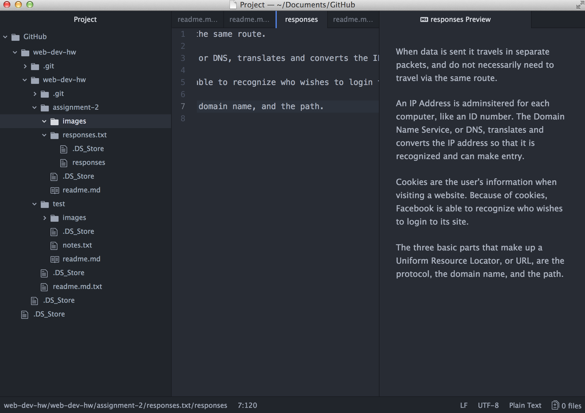

# Assignment 2

A Version Control System keeps record of any and all changes made when producing some kind of project, such as the one we are creating currently. By adding a title and committing your current progress, VCS essentially works as a computerized product manager, tracking every action made.

My [responses](./responses.txt)

## Work Cycle
I have never done anything that had to do with coding before, so there was struggle trying to crank this assignment out. It still did not at all come out looking the way I hoped it would, despite going through all of the videos and lectures. However, I did what I could, and I expect to really pick up some skills here shortly.

