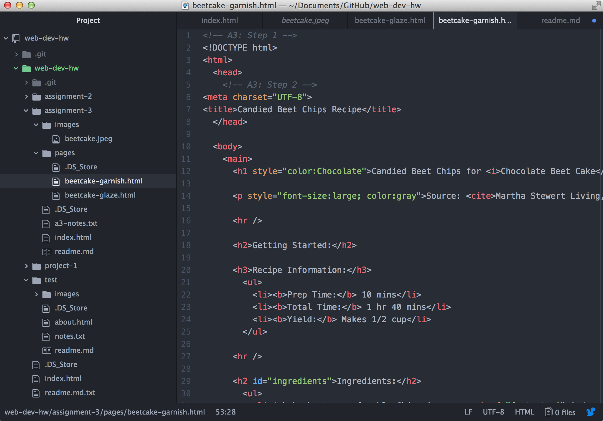

#Assignment 3 Tech Report

There is only one body, which is information included in the website, and there is only one head, which is information about the website, such as the title of it. The head also includes all metadata that helps display the website, however, it is not visible to viewers. The body, on the other hand, is all of the info, definitions and links that the viewer can interact with.

Whereas structural markup shows the viewers that layout of the content of a website, semantic markup directs which bits of information should be paid attention to, depending on size, style, etc.

For this assignment I definitely kept referring back to the course module for assistance, but overall it was a fun and easy assignment. I was wondering, however, why it was necessary to put quotes in HTML form and not just put quotation marks instead? Otherwise, I'm anxious to learn to become more comfortable when making lists or drop-down tabs. Thankfully, the <a href="w3schools.com">w3schools.com</a> editor helped me out a lot, because I got to test all of the changes I made to my HTMLs to ensure they looked as they should.

