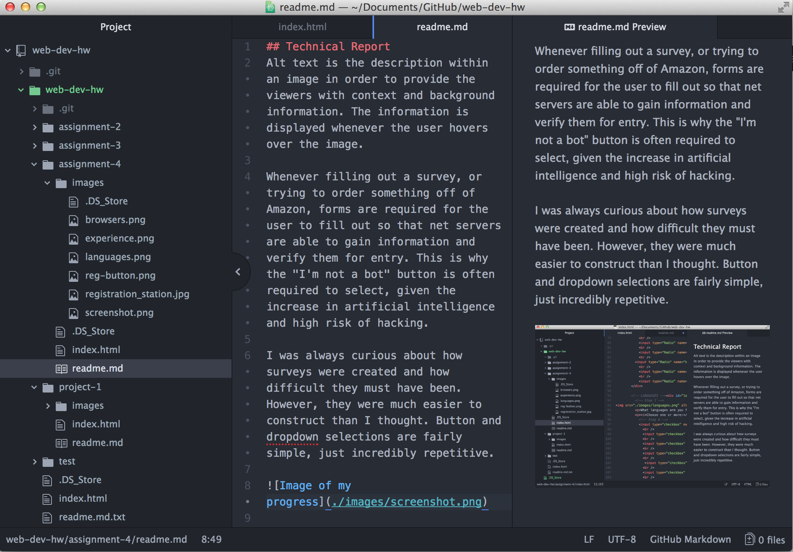

## Technical Report
Alt text is the description within an image in order to provide the viewers with context and background information. The information is displayed whenever the user hovers over the image.

Whenever filling out a survey, or trying to order something off of Amazon, forms are required for the user to fill out so that net servers are able to gain information and verify them for entry. This is why the "I'm not a bot" button is often required to select, given the increase in artificial intelligence and high risk of hacking.

I was always curious about how surveys were created and how difficult they must have been. However, they were much easier to construct than I thought. Button and dropdown selections are fairly simple, just incredibly repetitive.

