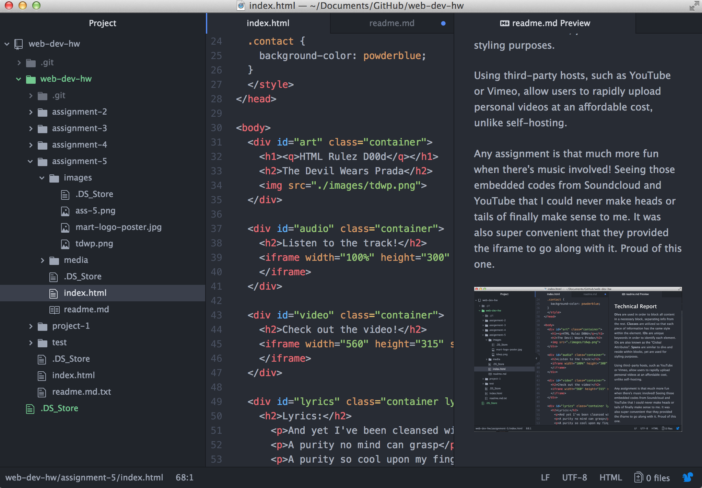

## Technical Report

<b>Divs</b> are used in order to block all content in a necessary block, separating info from the rest. <b>Classes</b> are utilized so that each piece of information has the same style within the element. <b>IDs</b> are unique keywords in order to identify each element. IDs are also known as the "Global Attributes". <b>Spans</b> are similar to divs and reside within blocks, yet are used for styling purposes.

Using third-party hosts, such as YouTube or Vimeo, allow users to rapidly upload personal videos at an affordable cost, unlike self-hosting.

Any assignment is that much more fun when there's music involved! Seeing those embedded codes from Soundcloud and YouTube that I could never make heads or tails of finally make sense to me. It was also super convenient that they provided the iframe to go along with it. Proud of this one.

