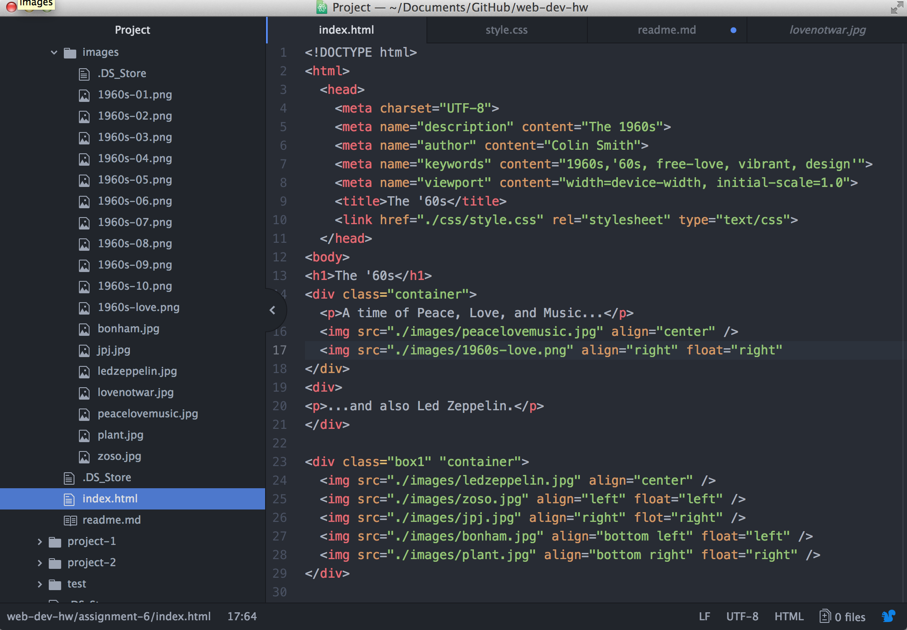

## Technical Report

If I could have travelled back to any decade in time it'd defenitely be the '60s. Civil rights, the expansion of the free press, sexual liberation, the 1960s were revolutionary for baby boomers. Given the drug craze and introduction to new music (especially during Vietnam), it was an especially colorful and vibrant time for young adults and teenagers. When you first visit my page you immediately see the giant "Peace, Love and Music" banner, which is known for the infamous Woodstock festival in 1969.

Given the rebellious aspect of many young individuals, I tried to reflect those colors through my page. My main background color was a lighter yellow (255, 255, 128), along with #FFCC00 and #660066 for the font. Although with the use of some of my images I tried to have it compliment my page.

When trying to realign some of my images, everything else shifted, for some reason. So I had that to deal with. Otherwise, I'm definitely a beginner with CSS, and there are a lot of complexities that come with the styling aspect of HTML.

