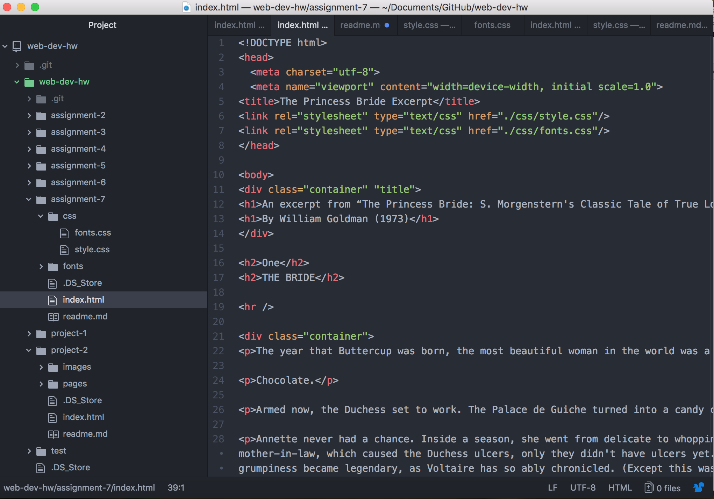

## Technical Report

For my fonts I chose Homemade Apple and PLayball, which appeal towards the theme of my "Princess Bride" page layout. Because it is a fantasy-based book set in a more medieval time, these fonts seemed appropriate.

System fonts are fonts already installed on a typical computer. Every time Pages or Microsoft Word is open, whatever fonts are available are known as system fonts. Web fonts are fonts that are customized and hosted on a server, in which 65 percent of websites are currently using. Finally, web-safe fonts are commonly-used fonts that both Macs and PCs share, such as Times New Roman or the infamous Comic Sans.

Fallback fonts work as a contingency plan should the primary font fail to provide for the webpage.

This assignment was surprisingly tough, compared to some of the other assignments. The more one gets into coding, the more complex and time-consuming it becomes. However, considering the style and theme of a font is definitely something I hadn't though of. I now understand how heavily relied on font can be for a website or a product, and how much they depend on their appeal.

