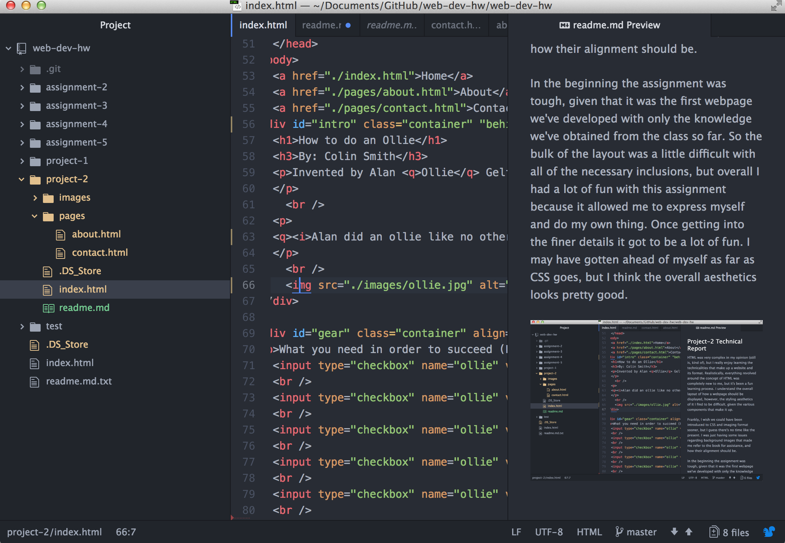

## Project-2 Technical Report
HTML was very complex in my opinion (still is, kind of), but I really enjoy learning the technicalities that make up a website and its format. Realistically, everything revolved around the concept of HTML was completely new to me, but it's been a fun learning process. I understand the overall layout of how a webpage should be displayed, however, the styling aesthetics of it I find to be difficult, given the various components that make it up.

Frankly, I wish we could have been introduced to CSS and imaging format sooner, but I guess there's no time like the present. I was just having some issues regarding background images that made me refer to the book for assistance, and how their alignment should be.

In the beginning the assignment was tough, given that it was the first webpage we've developed with only the knowledge we've obtained from the class so far. So the bulk of the layout was a little difficult with all of the necessary inclusions, but overall I had a lot of fun with this assignment because it allowed me to express myself and do my own thing. Once getting into the finer details it got to be a lot of fun. I may have gotten ahead of myself as far as CSS goes, but I think the overall aesthetics looks pretty good.

